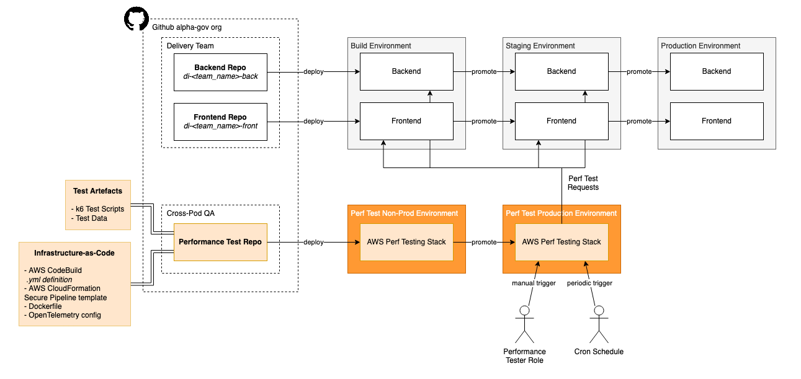
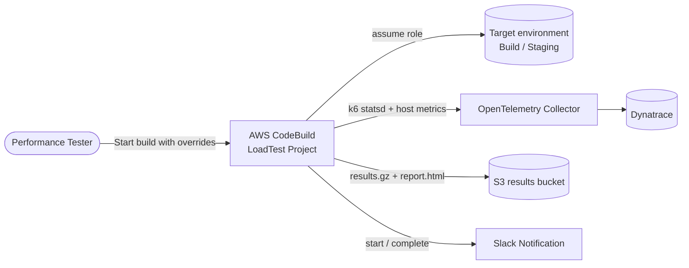

[](https://github.com/govuk-one-login/performance-testing/actions/workflows/publish.yaml)
[](https://github.com/govuk-one-login/performance-testing/actions/workflows/pre-merge-checks.yml)
[](https://github.com/govuk-one-login/performance-testing/actions/workflows/github-code-scanning/codeql)

---

# Performance Testing Framework

This repository contains the performance test framework for testing [GOV.uk One Login](https://www.gov.uk/using-your-gov-uk-one-login) (Digital Identity). It uses [Grafana K6](https://k6.io) to performance test happy path user journeys across the program's services, execute tests in AWS Codebuild and streams the results to [Dynatrace](https://www.dynatrace.com) for analysis

---

## Table of Contents

- [Overview](#overview)
- [Technology Stack](#technology-stack)
- [Infrastructure Diagram](#infrastructure-diagram)
- [Repository Structure](#repository-structure)
- [Pre-requisites](#pre-requisites)
- [Getting Started](#getting-started)
- [Reporting](#reporting)
- [Contributing](#contributing)

## Overview

Performance tests are written in [TypeScript](https://www.typescriptlang.org/), transpiled into JavaScript with [esbuild](https://esbuild.github.io/) and executed by Grafana K6. Test Scripts for each product team are placed in own folders, sharing a common library of utilities and reusable load profiles.


## Technology Stack

The infrastructure is defined as infrastructure-as-code in the form of a AWS CloudFormation [template](deploy/template.yaml). Its core is an AWS CodeBuild project that acts as the load-test orchestrator, running a Docker image built from the ['Dockerfile'](deploy/Dockerfile)
The image contains:

| Component | Purpose |
| --- | --- |
| [k6](https://k6.io) | Load injector built with [xk6](https://github.com/grafana/xk6) plus the [statsd output](https://github.com/LeonAdato/xk6-output-statsd) and [passkeys](https://github.com/corbado/xk6-passkeys) extensions |
| [OpenTelemetry Collector](https://github.com/open-telemetry/opentelemetry-collector-contrib) | Forwards K6 [statsd](https://k6.io/docs/results-output/real-time/statsd/) metrics from the AWS CodeBuild agent to Dynatrace, using ['otel-config-template.yaml'](deploy/otel-config-template.yaml)|
| Test data and scripts | Scripts are written in [TypeScript](https://www.typescriptlang.org/) and transpiled into JavaScript by [esbuild](https://esbuild.github.io/), plus supporting test data provided in the CSV/JSON files

---
## Infrastructure Diagram


At a high level, a test run flows as follows:


```mermaid
flowchart LR
    PerformanceTester([Performance Tester]) -->|Start build with overrides| CB[AWS CodeBuild <br/> LoadTest Project]
    CB -->|assume role| Target[(Target environment<br/>Build / Staging)]
    CB -->|k6 statsd + host metrics| OTel[OpenTelemetry Collector]
    OTel --> Dynatrace[(Dynatrace)]
    CB -->|results.gz + report.html| S3[(S3 results bucket)]
    CB -->|start / complete| Slack[Slack Notification]
```

The performance test application is initially deployed to the `di-performance-test-non-prod` AWS account and then promoted to the `di-performance-test-prod` account. From the Production account, performance tests can be run against any given Build or Staging environment.


## Repository Structure

```
performance-testing/
├── deploy/
│   ├── scripts/src/        # TypeScript test scripts, one folder per team
│   ├── reporting/          # Slack notifications and post-run analysis tools
│   ├── Dockerfile          # CodeBuild agent image
│   ├── template.yaml       # CloudFormation infrastructure
│   └── otel-config-template.yaml
├── dns/                    # DNS and ACM certificate stacks
├── koa-stub/               # Serverless OIDC stub used during performance tests
├── docs/                   # Diagrams and screenshots
└── .github/workflows/      # CI/CD pipelines
```

## Pre-requisites

### Required Installations

- **[k6](https://k6.io/docs/get-started/installation)** - runs the test scripts locally
```console
brew install k6
```
- **[Node.js](https://nodejs.org/en/download)** - used by esbuild to transpile the TypeScript files.
- **[pre-commit](https://pre-commit.com/)** - runs the pre-commit hooks locally (linting, secret detection, commit-message, formatting) that are also enforced in CI
  ```console
  brew install pre-commit && pre-commit install && pre-commit install -tprepare-commit-msg -tcommit-msg
  ```

### Optional Installations

- **[AWS CLI](https://docs.aws.amazon.com/cli/latest/userguide/getting-started-install.html)** for command line access to AWS resources
- **[AWS SAM CLI](https://docs.aws.amazon.com/serverless-application-model/latest/developerguide/install-sam-cli.html)** only needed for platform engineers managing the serverless resources and pipelines
  ```console
  brew install aws/tap/aws-sam-cli
  ```
- **[GDS CLI](https://github.com/alphagov/gds-cli)** for command line access to internal AWS accounts and resources
  ```console
  brew install alphagov/gds/gds-cli
  ```
- **[Docker](https://docker.com)** for building or testing the [`Dockerfile`](deploy/Dockerfile) locally

## Getting Started

Clone the repository and install the script dependencies

```console
git clone git@github.com:govuk-one-login/performance-testing.git
cd performance-testing/deploy/scripts
npm install
```

Transpile the TypeScript scripts to Javascript (output is written to `deploy/scripts/dist`):

```console
npm start
```

Run a test script with k6:

```console
k6 run dist/common/test.js
```

## Reporting

### Slack Notifications

[`deploy/reporting/slack.sh`](deploy/reporting/slack.sh) runs automatically inside the CodeBuild pipeline. It posts a Slack notification when a test starts and updates it on completion with:
- Pass/fail status
- Test script, profile, scenario and environment
- Links to Dynatrace k6 and ECS dashboards
- Link to the CodeBuild log and S3 results URI

### Advanced Reporting

[`deploy/reporting/advanced-reporting/`](deploy/reporting/advanced-reporting/) is a local post-processing tool for analysing `results.gz` files downloaded from S3. See [`MULTI-SCENARIO-PERF-REPORT-GEN-README.md`](deploy/reporting/advanced-reporting/MULTI-SCENARIO-PERF-REPORT-GEN-README.md) for full usage. Key features:

- Per-scenario steady-state time windows
- SLA breach detection (P95 > 1000ms, P99 > 2500ms)
- Excel report with Response Time, Journey Error Rate and HTTP Requests tabs
- Optional PNG graphs for breached transactions

```console
cd deploy/reporting/advanced-reporting
./multi-scenario-performance-report-generator.sh ../results.gz
```

---

## Contributing

If you would like to create a new test script or make changes to any of the existing test scripts, first read through the information in [`deploy/scripts/README.md`](deploy/scripts/README.md). Create a new `.ts` file in the appropriate team folder within the `deploy/scripts` directory or change an existing one.

Raise pull requests for any changes, including the JIRA ticket number in the description. Pull requests must pass pre-commit hooks, linting and unit test checks before merging to main.

If your changes include modifications to the [`Dockerfile`](deploy/Dockerfile) or [`template.yaml`](deploy/template.yaml), see [`deploy/README.md`](deploy/README.md) for instructions on how to test infrastructure changes in the Development environment before merging.
