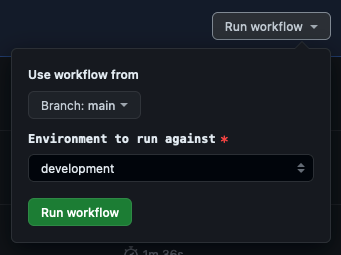

## Testing Infrastructure Changes

Changes to the CloudFormation Infrastructure-as-Code [`template.yaml`](template.yaml) or [`Dockerfile`](Dockerfile) can be tested in the Development (`di-devplatform-development [842766856468]`) environment before merging to main.

To deploy a feature branch to the Development environment:

1. Go to the '[Feature Branch Publish](https://github.com/govuk-one-login/performance-testing/actions/workflows/feature-branch-publish.yaml)' GitHub action

    

2. Click the 'Run Workflow' dropdown

3. Select the branch to deploy

    

4. Click 'Run Workflow'