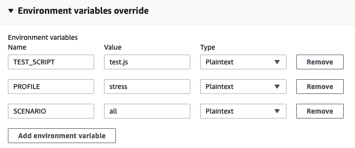

# Performance Test Scripts

This folder (`deploy/scripts`) contains the configuration, test scripts and test data for performance tests.

Test scripts are written in TypeScript, and transpiled into JavaScript via esbuild to run in k6. For deploying in environments these scripts are bundled into the Docker image which is used as the CodeBuild agent; when testing locally these can just be run directly from `deploy/scripts/dist`.

## Prerequisites

- [k6](https://k6.io/docs/getting-started/installation)
- [NodeJS](https://nodejs.org/en/download/)

## Local Installation

Clone the repository and navigate to this folder `deploy/scripts`. Then to install the dependencies in [`package.json`](package.json) run

```console
% npm install
```

### Linting

If using VSCode as an IDE it is recommended to install [ESLint](https://marketplace.visualstudio.com/items?itemName=dbaeumer.vscode-eslint) and set this to your default formatter for TypeScript files in this project.

You can also manually run linting checks in the `scripts` directory with
```console
% npm run lint
```

Further, you can add the `--fix` flag to fix any auto-fixable problems in your TypeScript files
```console
% npm run lint -- --fix
```

## Local Testing

Test scripts are contained in the `src` folder, with a folder for each product team. Test script files must match the path ( `src/<team_name>/*.ts`) specified in the [build.mjs](build.mjs#L8) file. Static data files are kept in `src/<team_name>/data` folders, they are copied to `dist/<team_name>/data` by esbuild as defined [here](build.mjs#L17-L24).

To run a TypeScript test locally, navigate to the `deploy/scripts` folder and run the following

```console
% npm start
```
This command will generate the JavaScript files in the `dist` folder. These can then be run with k6 in the normal way using a command such as

```console
% k6 run dist/common/test.js
```

## Unit Testing and Common Utilities

Unit tests to validate the TypeScript utility files are contained in the [`src/common/unit-tests.js`](src/common/unit-tests.ts) file. They can be run to validate the utilities are working as intended by running

```console
% npm test
```

This unit test also runs when raising pull requests as a [github action](../../.github/workflows/pre-merge-checks.yml). If adding an additional utility in the `src/common/utils` folder, add another `group` to the test script with `checks` to validate the behaviour.

## Environment Variables and Secrets

### Local

When running locally you can pass secrets and environment configuration variables via local environment variables or by passing them into k6 explicity (see [k6 docs](https://k6.io/docs/using-k6/environment-variables/)).

For example
```console
% export VARIABLE=value
```
or
```console
% k6 run dist/test.js -e VARIABLE=value
```

### Pipeline

When running in the CodeBuild pipeline you can pass in these variables or secrets with the environment variable overrides (see step 4 below).

Or you can add these to AWS SSM Parameter Store by:

- Adding a line to the CodeBuild [BuildSpec definition](../template.yaml) under `env.parameter-store.<variable-name>`
- Adding the parameter to the Parameter Store in the `di-performance-test-prod` account

Parameter store locations must start with the prefix `/perfTest/` in order for the CodeBuild agent role to access.

## Running Performance Tests in CodeBuild

1.  Login to [Control Tower](https://uk-digital-identity.awsapps.com/start#/)

2.  Login to the `di-performance-test-prod` account with the `di-perf-test-prod-testers` role.

3.  Go to the CodeBuild project and click 'Start build with overrides' ([Direct link](https://eu-west-2.console.aws.amazon.com/codesuite/codebuild/projects/LoadTest-perftest/builds/start?region=eu-west-2))

    

4.  Update environment variables in the 'Environment variables override' section. All environment variables are available in test scripts in the `__ENV` variable (see [k6 docs](https://k6.io/docs/using-k6/environment-variables/))

    

    |Environment Variable|Example Values|Description|
    |-|-|-|
    |`TEST_SCRIPT`|`accounts/test.js`</br>`authentication/test.js`</br>`common/test.js`<sup>[_default_]</sup></br>`common/unit-tests.js`|Relative path of test script to use, including `.js` extension|
    |`PROFILE`|`smoke`<sup>[_default_]</sup></br>`stress`</br>`load`|Used to select a named load profile described in the test script. Values should match the keys of a [`ProfileList`](src/common/utils/config/load-profiles.ts#L4) object|
    |`SCENARIO`|`all`<sup>[_default_]</sup></br>`sign_in`</br>`create_account,sign_in`|Comma seperated list of scenarios to enable. Blank strings or `'all'` will default to enabling all scenarios in the selected load profile. Implementation in [`getScenarios`](src/common/utils/config/load-profiles.ts#L27-L36) function|
    |`ENVIRONMENT`|`build`<sup>[_default_]</sup></br>`staging`|Name of the environment where the test is being conducted. Accepted Values are build/staging depending on the test scenario|

Note: To overcome latency issues caused by lambda cold starts, a [lambda warmer script](src/common/lambda-warmer.ts) is ran before performance tests. This sends concurrent requests to the respective imposter stub.

5. Click 'Start Build'

6. Build progress and the stdout results summary are printed in the 'Build logs'

## Querying the Test Result File

After each pipeline run, the test results file is zipped and uploaded to S3.

1.  To download the file: navigate to the s3 bucket in the AWS account. The bucket name is `perftest-test-results-<stack_id>`.

    Here results files are organised by team name, script name and the date and time the test run finished.
    The file prefix will be of the form `<team_name>/<script_name>/YY-MM-DD/hh:mm:ss/results.gz`.

2.  Expand the archive using `gunzip`

    ```console
    % gunzip -c path/to/results.gz > output/path/results.json
    ```

3.  The results file contains one metric per line, eahc in the form of a JSON object. This file can now be queried using `jq`.

    > **Note**
    > The [k6 documentation](https://k6.io/docs/results-output/real-time/json/) has further information on this file format and querying


### Useful `jq` queries

**Error Count by Group Name and Status Code**

The following command filters the results on errors and then totals the count by group and status
```console
% cat path/to/results.json |
jq 'select(
        .type=="Point" and
        .metric=="http_req_failed" and
        .data.value==1
    ) | {
        "group":.data.tags.group,
        "status":.data.tags.status
    }' |
jq -s 'group_by(.group,.status)
    | map({
        "group":first.group,
        "status":first.status,
        "count":length
    })
    | sort_by(.count)
    | reverse' > error-counts.json
```

The output of the above command can be further pretty printed into a table using `jq` and `column`
```console
% cat error-counts.json |
jq -r '(
        ["Group Name","Status","Count"]
        | (., map(length*"-"))
    ),
    (
        .[]
        | [.group, .status, .count]
    )
    | @tsv'
    | column -ts$'\t'
```

**Converting to CSV**

The results file can also be coverted to CSV format (for example to easily calculate repsonse time percentiles in Excel, or for graphing purposes). The following command produces a CSV with columns: `timestamp`, `group name` and `duration in milliseconds`

```console
% jq -r 'select(
        .type=="Point" and
        .metric=="duration"
    ) | [
        .data.time,
        .data.tags.group,
        .data.value
    ] | @csv' path/to/results.json > durations.csv
```